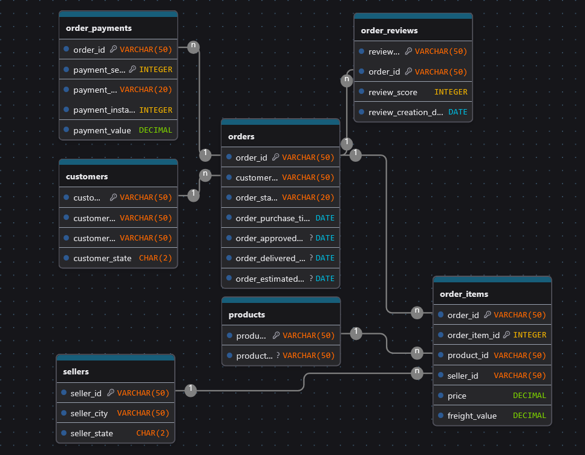
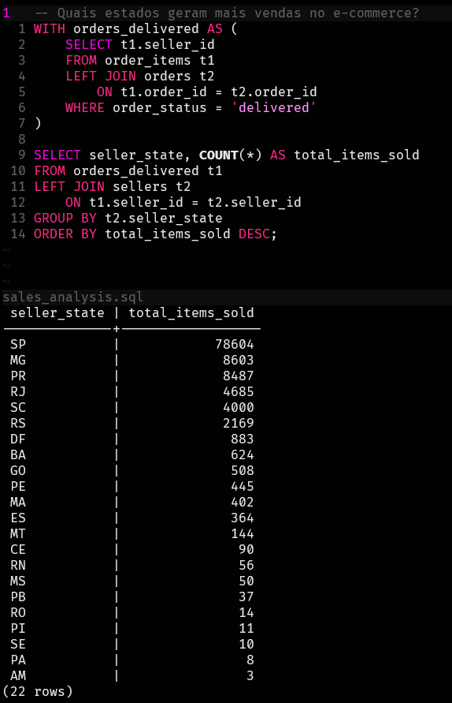
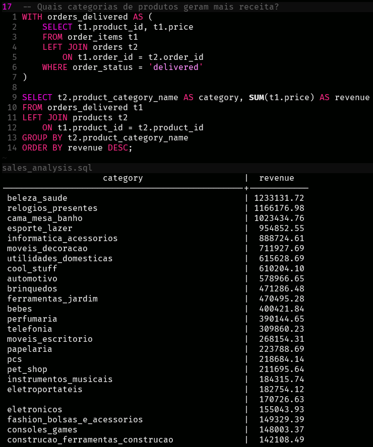
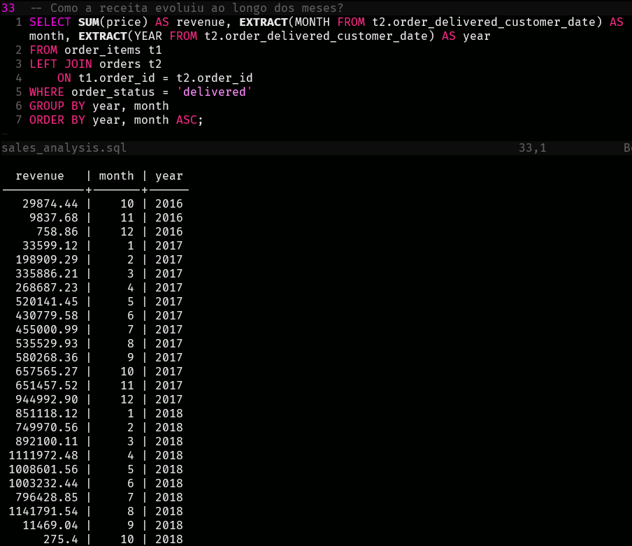
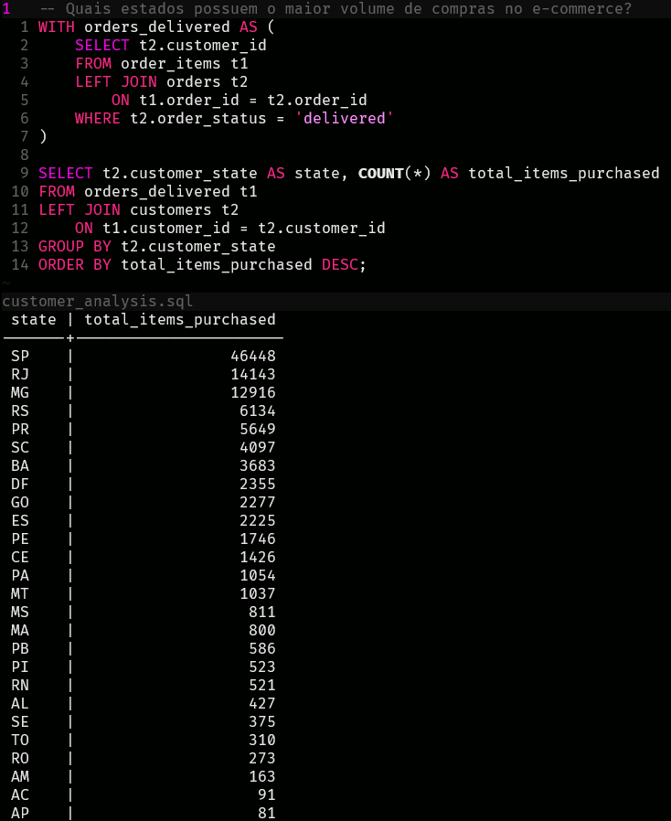
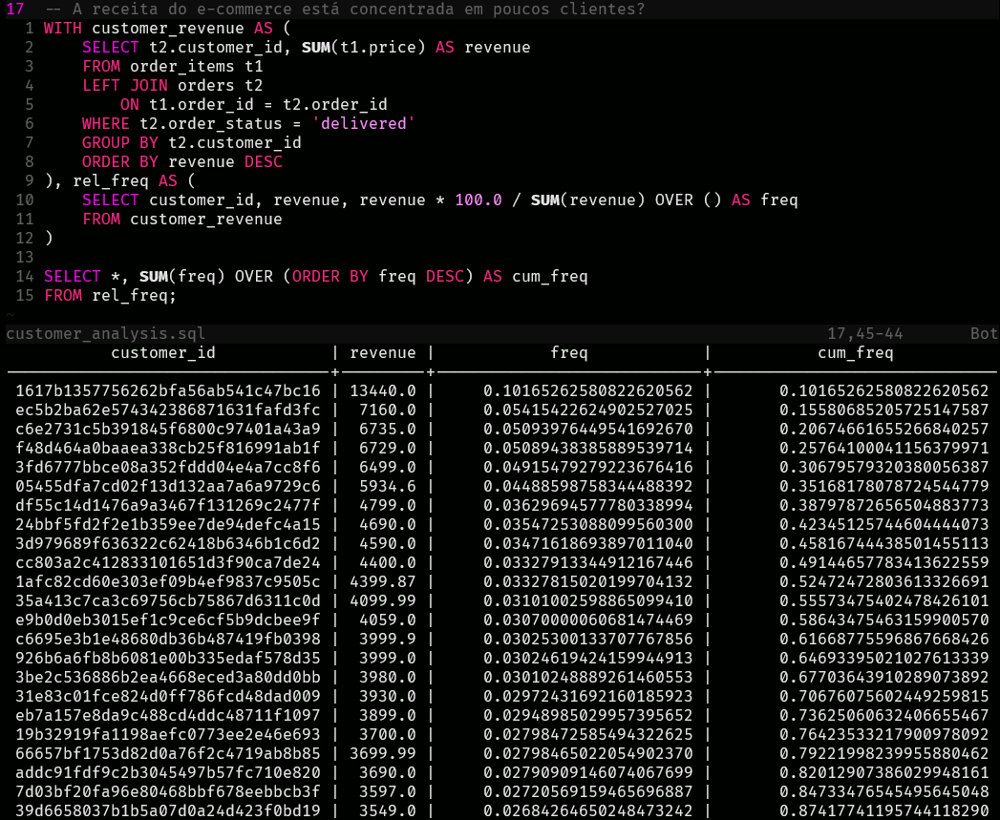
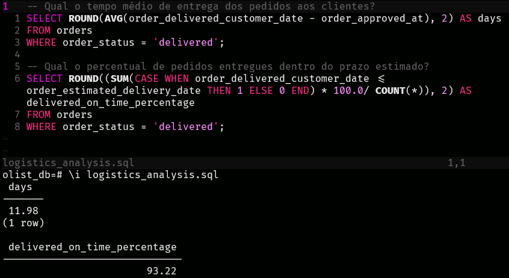
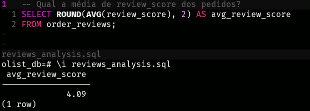
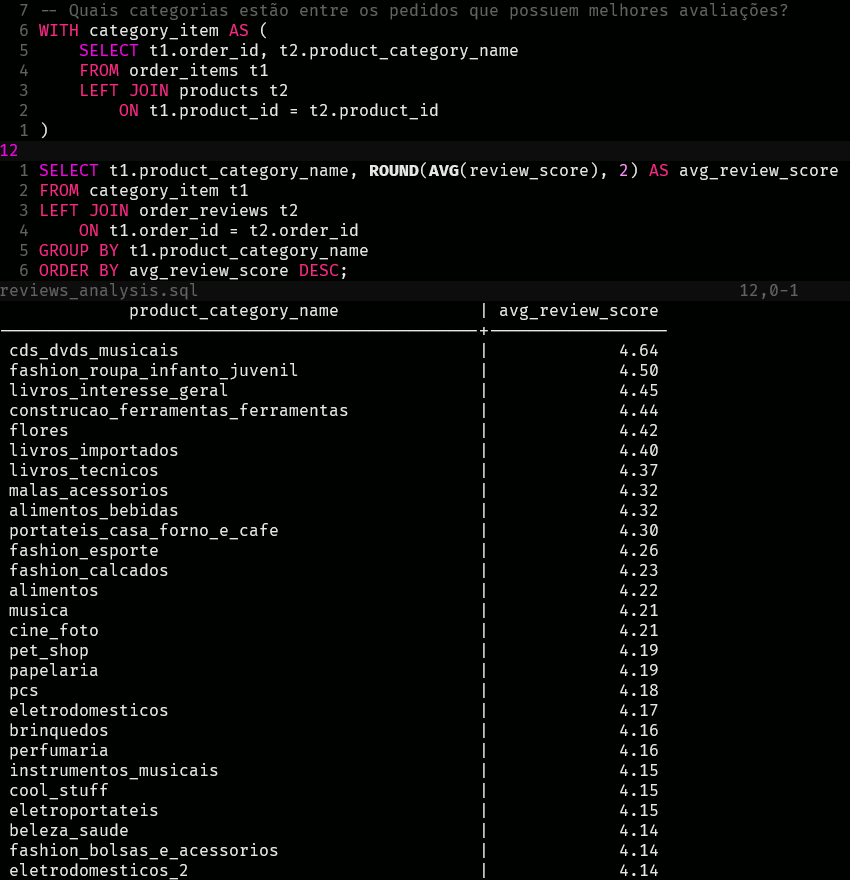
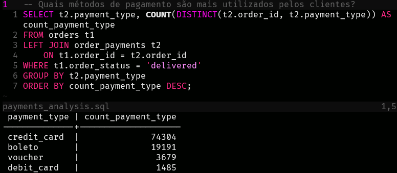

# Análise de Dados de um Marketplace Brasileiro

## Base de dados
- **Descrição:** Brazilian E-Commerce Public Dataset (Conjunto de Dados de E-Commerce Brasileiro)
- **Fonte:** Kaggle
- **Ferramentas:** Python (pandas), PostgreSQL, SQL

## Objetivo do Projeto
Construir uma pipeline completa de análise de dados e extrair insights de negócio a partir de dados de um e-commerce brasileiro.

## Estrutura
- data
    - olist_customers_dataset.csv
    - olist_geolocation_dataset.csv
    - olist_order_items_dataset.csv
    - olist_order_payments_dataset.csv
    - olist_order_reviews_dataset.csv
    - olist_orders_dataset.csv
    - olist_products_dataset.csv
    - olist_sellers_dataset.csv
    - product_category_name_translation.csv
- python
    - data_exploration.py
    - etl.py
- sql
    - schema.sql
    - sales_analysis.sql
    - logistics_analysis.sql
    - payments_analysis.sql
    - reviews_analysis.sql
    - customer_analysis.sql
- requirements.txt

## Entender os dados

Abrir os arquivos .csv no Python (pandas) e explorar suas colunas e informações básicas, a fim de identificar os relacionamentos entre as tabelas.

### Tabelas

**1. customers**

- Colunas: customer_id (str), customer_unique_id (str), customer_zip_code_prefix (int), customer_city (str), customer_state (str)

- Descrição: Tabela com informações dos clientes.

**2. geolocation**

- Colunas: geolocation_zip_code_prefix (int), geolocation_lat (float), geolocation_lng (float), geolocation_city (str), geolocation_state (str)

- Descrição: Tabela com informações geográficas relacionadas aos CEPs.

**3. orders**

- Colunas: order_id (str), customer_id (str), order_status (str), order_purchase_timestamp (str), order_approved_at (str), order_delivered_carrier_date (str), order_delivered_customer_date (str), order_estimated_delivery_date (str)

- Descrição: Tabela com informações gerais sobre os pedidos realizados.

**4. order_payments**

- Colunas: order_id (str), payment_sequential (int), payment_type (str), payment_installments (int), payment_value (float)

- Descrição: Tabela com informações sobre os pagamentos dos pedidos.

**5. order_reviews**

- Colunas: review_id (str), order_id (str), review_score (int), review_comment_title (str), review_comment_message (str), review_creation_date (str), review_answer_timestamp (str)

- Descrição: Tabela com as avaliações feitas pelos clientes para os pedidos.

**6. order_items**

- Colunas: order_id (str), order_item_id (int), product_id (str), seller_id (str), shipping_limit_date (str), price (float), freight_value (float)

- Descrição: Tabela com os itens associados aos pedidos.

**7. products**

- Colunas: product_id (str), product_category_name (str), product_name_lenght (float), product_description_lenght (float), product_photos_qty (float), product_weight_g (float), product_length_cm (float), product_height_cm (float), product_width_cm (float)

- Descrição: Tabela com informações sobre os produtos.

**8. sellers**

- Colunas: seller_id (str), seller_zip_code_prefix (int), seller_city (str), seller_state (str)

- Descrição: Tabela com informações dos vendedores.

**9. product_category**

- Colunas: product_category_name (str), product_category_name_english (str)

- Descrição: Tabela com o nome das categorias dos produtos em português e inglês.

## Limpeza com Python

- customers: Remoção da coluna customer_zip_code_prefix e tratamento de possíveis espaços em branco nas colunas do tipo string.

- geolocation: Remoção da tabela, pois não será utilizada nas análises.

- orders: Remoção da coluna order_delivered_carrier_date, conversão das colunas de data do tipo string para date e tratamento de possíveis espaços em branco nas colunas do tipo string.

- order_payments: Tratamento de possíveis espaços em branco nas colunas do tipo string.

- order_reviews: Remoção das colunas review_comment_title, review_comment_message e review_answer_timestamp, conversão da coluna de data do tipo string para date e tratamento de possíveis espaços em branco nas colunas do tipo string.

- order_items: Remoção da coluna shipping_limit_date e tratamento de possíveis espaços em branco nas colunas do tipo string.

- products: Remoção das colunas product_name_lenght, product_description_lenght, product_photos_qty, product_weight_g, product_length_cm, product_height_cm e product_width_cm, além do tratamento de possíveis espaços em branco nas colunas do tipo string.

- sellers: Remoção da coluna seller_zip_code_prefix e tratamento de possíveis espaços em branco nas colunas do tipo string.

- product_category: Remoção da tabela, pois não será utilizada nas análises.

## Modelar o banco

Usar a ferramenta DrawDB para criar visualmente as tabelas e as relações entre elas.

## Criar banco manualmente

Criar o banco de dados Postgres (CREATE DATABASE olist_db;)

Adicionar as tabelas, suas colunas, chaves primárias e chaves estrangeiras (schema.sql).

Criar usuário olist_user e dar permissões no banco e no schema.

## Inserir dados no banco de dados

Utilizar o sqlalchemy para inserir os dados no banco pelo Python.

## Criar queries analíticas

Negócio: Olist (E-Commerce Brasileiro)

Plataforma de marketplace online, semelhante ao Mercado Livre, onde vendedores e compradores interagem por meio da compra e venda de produtos de diferentes categorias. Cada produto possui informações como preço e valor de frete, além da possibilidade de receber avaliações dos clientes após a compra. Os pedidos podem ser pagos utilizando diferentes métodos de pagamento, incluindo vouchers de desconto. Após a aprovação do pagamento, os produtos passam pelo processo de entrega ao cliente.

Perguntas de negócio:

### sales_analysis.sql

- Quais estados geram mais vendas no e-commerce?

O volume de vendas está fortemente concentrado na região Sudeste. Só São Paulo tem quase 80 mil vendas registradas.

- Quais categorias de produtos geram mais receita?

Apenas três categorias ultrapassaram 1 milhão em receita, são elas: beleza e saúde, relógios e cama, mesa e banho.

- Como a receita evoluiu ao longo dos meses?

A receita manteve uma tendência de alta, atingindo seu âpice no primeiro semestre de 2018. Nos últimos meses de análise, parece que a receita teve uma queda brusca, não necessariamente isso representa uma queda real, já que os últimos meses possuem poucos registros, indicando que o dataset pode estar incompleto nesse período.

### customer_analysis.sql

- Quais estados possuem o maior volume de compras no e-commerce?

O volume de compras também está concentrado na região Sudeste, porém com uma distribuição mais equilibrada entre os estados.

- A receita do e-commerce está concentrada em poucos clientes?

A receita não aparenta estar excessivamente concentrada em poucos clientes, sugerindo uma base relativamente distribuída de consumidores.

### logistics_analysis.sql

- Qual o tempo médio de entrega dos pedidos aos clientes?

Aproximadamente 12 dias.

- Qual o percentual de pedidos entregues dentro do prazo estimado?

93% dos pedidos foram entregues dentro do prazo estimado.

### reviews_analysis.sql

- Qual a média de review_score dos pedidos?

A média de avaliações dos pedidos é 4, num intervalo de 0 até 5. Indicando uma percepção geral positiva dos clientes em relação ao serviço.

- Quais categorias estão entre os pedidos que possuem melhores avaliações?

As categorias que estão entre os pedidos que possuem melhores avaliações são CDs e DVDs musicais, roupa infanto juvenil e livros de interesse geral.

*Análise feita dessa forma, pois as reviews estão associadas aos pedidos, e não aos produtos separadamente.*

### payments_analysis.sql

- Quais métodos de pagamento são mais utilizados pelos clientes?

O método de pagamento mais utilizado é cartão de crédito. 4 vezes mais utilizado do que o boleto, que ocupa a segunda posição.

